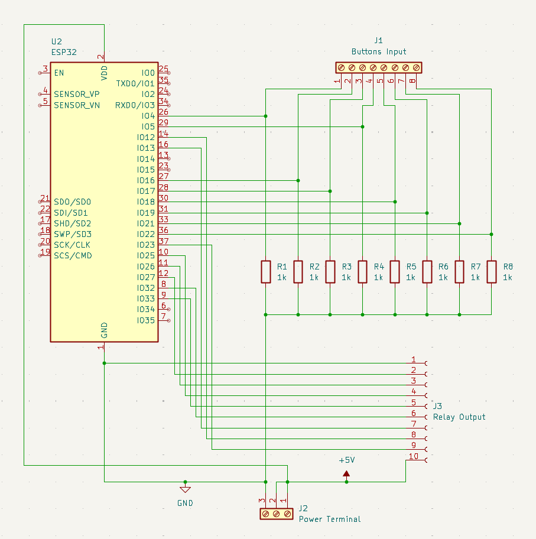
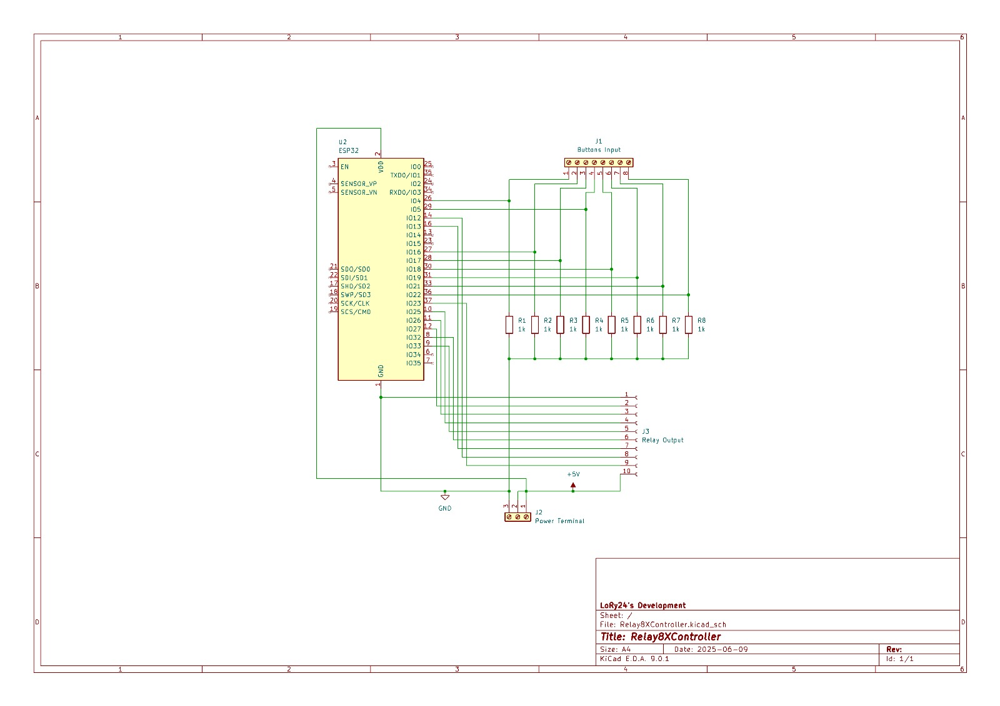

# ⚡ Schematica
Qui di seguito è esposta la schematica del progetto. Si ricorda che l'ESP32 usato nel disegno deve essere direttamente
associato alla DEVBOARD e non al processore singolo, in quanto quello attuale NON è programmabile. Sono mostrate tutte le
versioni, sia una specifica che quella completa.

